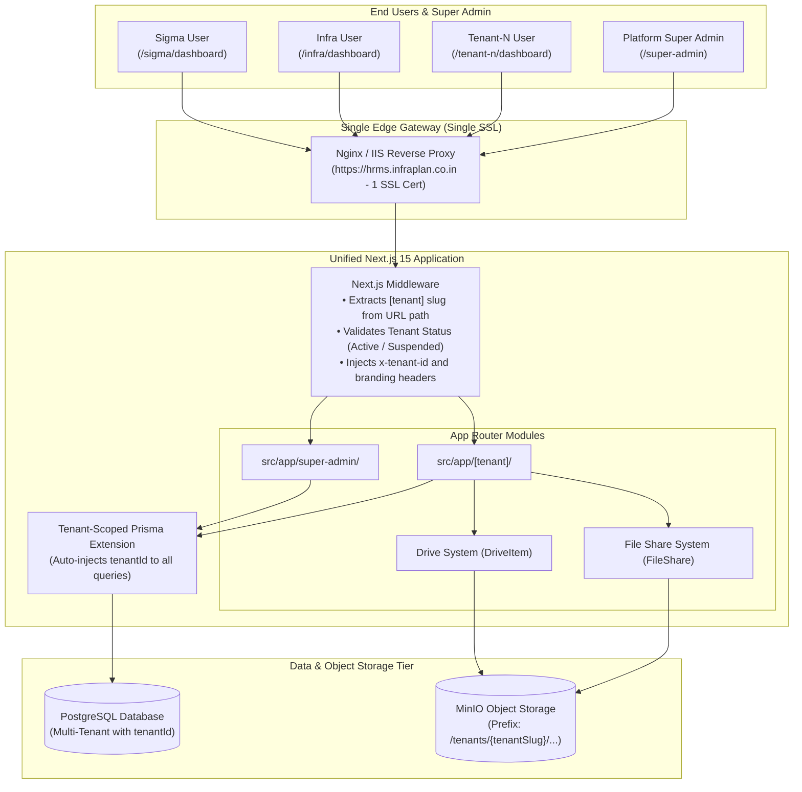

# Multi-Tenant SaaS Architecture & Migration Blueprint (Path-Based Routing)

## 1. Executive Summary & Problem Resolution

### 1.1 The Routing & Certificate Revolution: Path-Based Multi-Tenancy
By adopting **Path-Based Multi-Tenant Routing** (e.g., `https://hrms.infraplan.co.in/{tenantSlug}`):
- **1 Single Domain & 1 SSL Certificate**: No wildcard DNS, no multi-subdomain SSL renewal failures, and no IIS/Nginx virtual host configuration per tenant.
- **Zero Deployment Friction**: A single server cluster / container handles all tenants (`/sigma`, `/infra`, `/tenant-1`, `/tenant-2`) and the Platform Super Admin (`/super-admin`).
- **Instant Tenant Provisioning**: Onboarding a new client tenant takes **< 1 second** directly from the Super Admin Panel—no DNS changes, no server reloads, and no port allocations.
- **Preservation of FileShare**: The internal and peer-to-peer **FileShare** system is retained as a distinct, dedicated feature, while the legacy `LibraryDocument` and `ProjectDocument` schemas are completely decommissioned in favor of the Drive architecture.

---

## 2. URL Path Architecture & Next.js Routing Structure

```
https://hrms.infraplan.co.in/
│
├── /super-admin/                      ─── Platform Management Portal (Super Admin only)
│   ├── /tenants                       ─── Onboard & manage tenant organizations
│   ├── /subscriptions                 ─── Plan limits, seat allocations, billing
│   ├── /analytics                     ─── System health, storage, global metrics
│   └── /audit-logs                    ─── Platform-wide security audit logs
│
├── /share/[token]                     ─── Universal Public File / Drive Share Links
│
└── /[tenant]/                         ─── Dynamic Tenant Namespace (e.g., /sigma, /infra)
    ├── /login                         ─── Branded Tenant Login (Logo, Company Title)
    ├── /dashboard                     ─── Main Employee & Admin Dashboard
    │   ├── /employee                  ─── Attendance, Punch-in/out, Geofencing
    │   ├── /leaves                    ─── Leave applications & balances
    │   ├── /projects                  ─── Task management & milestone tracking
    │   ├── /documents                 ─── Google Drive-Style Document Management
    │   ├── /file-share                ─── Dedicated Internal File Share Module (Retained!)
    │   ├── /accountant                ─── Payroll & Salary structures
    │   ├── /departments               ─── Department rosters & org hierarchy
    │   ├── /announcements             ─── Company announcements
    │   └── /admin/settings            ─── Tenant-level settings & user management
    └── /profile                       ─── User profile & preferences
```

---

## 3. High-Level System Architecture Diagram



---

## 4. Multi-Tenant Data Model Redesign

### 4.1 New `Tenant` & `SuperAdmin` Models

```prisma
// ── Platform & Multi-Tenant Entities ────────────────────────────────────────

enum TenantStatus {
  TRIAL
  ACTIVE
  SUSPENDED
  EXPIRED
  ARCHIVED
}

enum SubscriptionTier {
  STARTER
  PROFESSIONAL
  ENTERPRISE
  CUSTOM
}

model Tenant {
  id                    String           @id @default(cuid())
  slug                  String           @unique // e.g. "sigma", "infra", "tenant-1"
  name                  String           // e.g. "Sigma Infraplan"
  legalName             String?          // e.g. "SIGMA INFRAPLAN ENGINEERING PVT. LTD."
  address               String?
  tagline               String?
  logoUrl               String?
  primaryColor          String?          @default("#2563eb")
  
  // Status & Subscription Limits
  status                TenantStatus     @default(ACTIVE)
  plan                  SubscriptionTier @default(STARTER)
  maxUsers              Int              @default(50)
  driveQuotaBytes       Float            @default(53687091200) // 50 GB default
  
  // Feature Toggles (Enable/Disable per tenant)
  payrollEnabled        Boolean          @default(true)
  geofencingEnabled     Boolean          @default(true)
  driveEnabled          Boolean          @default(true)
  fileShareEnabled      Boolean          @default(true)
  taskCommitmentEnabled Boolean          @default(true)
  
  // Custom Email / SMTP settings (optional per tenant)
  smtpHost              String?
  smtpPort              Int?
  smtpUser              String?
  smtpPass              String?
  smtpFrom              String?
  
  createdAt             DateTime         @default(now())
  updatedAt             DateTime         @updatedAt

  // Tenant-scoped relations
  users                 User[]
  departments           Department[]
  locations             Location[]
  projects              Project[]
  driveItems            DriveItem[]
  fileShares            FileShare[]
  announcements         Announcement[]
  roleDefinitions       RoleDefinition[]
  activityLogs          ActivityLog[]

  @@index([slug])
  @@index([status])
}

model SuperAdmin {
  id        String   @id @default(cuid())
  email     String   @unique
  name      String
  password  String
  createdAt DateTime @default(now())
  updatedAt DateTime @updatedAt
}
```

---

### 4.2 Legacy Document Cleanup vs FileShare Retention

#### ❌ Removed Legacy Models (No longer needed):
```diff
- model LibraryDocument {
-   id         String   @id @default(cuid())
-   name       String
-   fileUrl    String
-   size       Int
-   type       String
-   category   String   @default("Uncategorized")
-   bucket     String   @default("library")
-   uploadedBy String
-   user       User     @relation(fields: [uploadedBy], references: [id])
-   createdAt  DateTime @default(now())
-   updatedAt  DateTime @updatedAt
- }

- model ProjectDocument {
-   id         String   @id @default(cuid())
-   name       String
-   fileUrl    String
-   size       Int
-   type       String
-   category   String   @default("Uncategorized")
-   bucket     String   @default("project-documents")
-   uploadedBy String
-   user       User     @relation(fields: [uploadedBy], references: [id])
-   createdAt  DateTime @default(now())
-   updatedAt  DateTime @updatedAt
- }
```

#### ✅ Retained & Tenant-Scoped `FileShare` Model:
```prisma
model FileShare {
  id             String       @id @default(cuid())
  tenantId       String
  tenant         Tenant       @relation(fields: [tenantId], references: [id], onDelete: Cascade)
  
  uploaderId     String
  uploader       User         @relation("FileShareUploader", fields: [uploaderId], references: [id], onDelete: Cascade)

  fileName       String
  storageKey     String
  mimeType       String
  size           Int
  bucket         String?      @default("file-shares")
  isFolder       Boolean      @default(false)

  expiresAt      DateTime?
  maxViews       Int?
  currentViews   Int          @default(0)

  sharedWith     User[]       @relation("FileShareRecipients")
  sharedWithDepts Department[] @relation("FileShareDepartments")

  createdAt      DateTime     @default(now())
  updatedAt      DateTime     @updatedAt

  @@index([tenantId])
  @@index([uploaderId])
  @@index([expiresAt])
}
```

---

## 5. Next.js Path-Based Middleware & Tenant Scoping

### 5.1 Next.js Middleware (`src/middleware.ts`)
The middleware parses the first segment of the pathname to identify the tenant:

```typescript
// src/middleware.ts
import { NextRequest, NextResponse } from "next/server";

const RESERVED_PATHS = [
  "super-admin",
  "api",
  "_next",
  "favicon.ico",
  "share",
  "public",
  "assets"
];

export async function middleware(req: NextRequest) {
  const { pathname } = req.nextUrl;
  const segments = pathname.split("/").filter(Boolean);
  const firstSegment = segments[0];

  // 1. Check if root path (/)
  if (!firstSegment) {
    return NextResponse.redirect(new URL("/super-admin/login", req.url));
  }

  // 2. Check if reserved/system path
  if (RESERVED_PATHS.includes(firstSegment)) {
    return NextResponse.next();
  }

  // 3. First segment is tenant slug (e.g., 'sigma', 'infra', 'tenant-1')
  const tenantSlug = firstSegment;

  // Clone headers and inject tenant context
  const requestHeaders = new Headers(req.headers);
  requestHeaders.set("x-tenant-slug", tenantSlug);

  return NextResponse.next({
    request: {
      headers: requestHeaders,
    },
  });
}

export const config = {
  matcher: ["/((?!api/auth|_next/static|_next/image|favicon.ico).*)"],
};
```

---

## 6. Super Admin Management Portal Layout & Capabilities

Accessible at `https://hrms.infraplan.co.in/super-admin`:

```
┌──────────────────────────────────────────────────────────────────────────────────┐
│  HRMS PLATFORM SUPER ADMIN                                  [Super Admin User ▾]  │
├──────────────────────────────────────────────────────────────────────────────────┤
│  📊 Overview   🏢 Tenant Organizations   💳 Subscriptions   ⚙️ System Settings    │
├──────────────────────────────────────────────────────────────────────────────────┤
│                                                                                  │
│  [+ Onboard New Tenant]      [Search Tenants...]        [Status: All ▾]          │
│                                                                                  │
│  TENANT NAME        SLUG       URL PATH       USERS    STORAGE   STATUS   ACTION │
│  ──────────────────────────────────────────────────────────────────────────────  │
│  Sigma Infraplan    sigma      /sigma         42/100   18.4 GB   Active   [Edit] │
│  Infraplan Eng.     infra      /infra         18/30     4.2 GB   Active   [Edit] │
│  Client Tenant 1    tenant-1   /tenant-1       9/20     1.1 GB   Active   [Edit] │
│  Client Tenant 2    tenant-2   /tenant-2       4/10     0.4 GB   Trial    [Edit] │
│                                                                                  │
└──────────────────────────────────────────────────────────────────────────────────┘
```

### 6.1 Super Admin Key Actions
1. **Instant Tenant Onboarding Wizard**:
   - Organization Name, URL Slug (e.g. `client-a`), Admin Email, Initial Password.
   - Company Branding (Custom Logo, Primary Color, Letterhead address, Tagline).
   - Module Toggles: Payroll, Geofencing, Drive, FileShare, Task Commitment.
   - Resource Limits: Max Users, Max Storage (GB).
2. **One-Click Tenant Impersonation (Support Mode)**:
   - Super Admin can click "Support Login" to open `/tenant-slug/dashboard` as Tenant Admin with an audited support token.
3. **Tenant Lifecycle Control**:
   - Active, Suspended, Expired. Suspended tenants immediately block employee punch-ins with a "Subscription Suspended" page.

---

## 7. Multi-Tenant Storage Partitioning (MinIO / S3)

Both **Drive** and **FileShare** utilize partitioned prefix paths under the same bucket infrastructure:

```
s3://hrms-cloud-storage/
  ├── tenants/
  │   ├── sigma/
  │   │   ├── drive/
  │   │   ├── file-shares/
  │   │   └── avatars/
  │   ├── infra/
  │   │   ├── drive/
  │   │   ├── file-shares/
  │   │   └── avatars/
  │   └── tenant-1/
```

---

## 8. Migration & Execution Plan

### Step 1: Legacy Document Cleanup (Zero Breaking Changes to FileShare & Drive)
1. Delete models `LibraryDocument` and `ProjectDocument` from [prisma/schema.prisma](file:///d:/Live%20projects/hrms/prisma/schema.prisma).
2. Remove legacy references (`libraryDocuments`, `projectDocuments`) from `model User`.
3. Delete dead action files [src/actions/library.ts](file:///d:/Live%20projects/hrms/src/actions/library.ts) and [src/actions/project-documents.ts](file:///d:/Live%20projects/hrms/src/actions/project-documents.ts).
4. Delete dead client components [library-client.tsx](file:///d:/Live%20projects/hrms/src/components/features/library/library-client.tsx) and [project-documents-client.tsx](file:///d:/Live%20projects/hrms/src/components/features/documents/project-documents-client.tsx).

### Step 2: Database Schema Upgrade (Multi-Tenancy Layer)
1. Add `Tenant` and `SuperAdmin` models in [prisma/schema.prisma](file:///d:/Live%20projects/hrms/prisma/schema.prisma).
2. Add `tenantId` foreign key to `User`, `Department`, `Project`, `Task`, `Attendance`, `DriveItem`, `FileShare`, `PayrollRecord`, etc.
3. Build the tenant query wrapper in `src/lib/prisma-tenant.ts`.

### Step 3: URL Path Routing & Dynamic Tenant Context
1. Configure `src/middleware.ts` for path-based tenant detection.
2. Structure app folder with `src/app/[tenant]/` and `src/app/super-admin/`.
3. Update NextAuth session to include `tenantId`, `tenantSlug`, and `tenantBranding`.

### Step 4: Super Admin Management Dashboard
1. Implement Super Admin UI at `/super-admin` with Tenant CRUD, provisioning wizard, and analytics.
2. Build support impersonation mechanism.

### Step 5: Merge Existing Data (Sigma & Infraplan Databases)
1. Execute data migration script to import records from standalone databases into the unified DB with their respective `tenantId`.
2. Move stored files in MinIO to the new tenant-prefixed storage folders.
