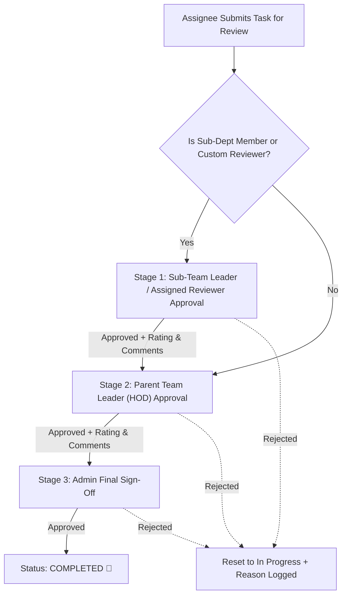

# Sub-Department Leadership & 3-Tier Task Review System Walkthrough

We have completed the implementation of the **Sub-Department Leadership**, **3-Tier Sequential Review Workflow**, and **Parent/Sub-Department Task Aggregation**.

---

## 🚀 What Was Built

### 1. Sub-Department & Sub-Team Leader Management
- **Admin as Department Head / Team Leader**: Admins and System Admins can now be assigned as Department Heads (TLs) or Sub-Team Leaders (Sub-TLs) directly in the Department Management interface ([edit-department-dialog.tsx](file:///d:/Live%20projects/hrms/src/components/features/admin/edit-department-dialog.tsx)).
- **Sub-TL Configuration**: Sub-departments can have their own designated leader (Sub-Team Leader) assigned without clearing parent department relations.
- **Session & Permissions**: Updated NextAuth session to load all led department IDs (`ledDepartmentIds`), giving Sub-TLs management authority over their sub-department without elevating them to top-level HODs, while granting Admins dual authority as both Admin and Department Leader.
- **Visual Distinction**:
  - Main department heads display as **Team Leader (TL)**.
  - Sub-department leaders display as **Sub-Team Leader (Sub-TL)**.
  - Sub-departments without a designated Sub-TL cleanly show fallback to **Parent Dept Leader**.

---

### 2. 3-Tier Task Review & Approval Pipeline
We implemented a strict, sequential 3-tier approval hierarchy for tasks:

- **Stage 1 (Sub-TL / Explicit Reviewer Review)**:
  - Required if the task belongs to a sub-department or has a designated reviewer (`Task.reviewerId`).
  - Records `subTlApproved = true`, `subTlRating`, and `subTlApprovalComment`.
  - Notifies the parent Team Leader that Stage 1 has been cleared.
- **Stage 2 (Parent Team Leader Review)**:
  - Required for all department tasks.
  - Records `tlApproved = true`, `tlRating`, and `tlApprovalComment`.
  - Notifies Admins that Stage 2 has been cleared.
- **Stage 3 (Admin Final Sign-Off)**:
  - Admin conducts the final quality check and sign-off.
  - Records `adminApproved = true`, `adminRating`, `adminApprovalComment`, marks task status as `COMPLETED`, logs `actualEnd`, and notifies the assignee.
- **Rejection & Re-open**:
  - Any authorized reviewer in the chain or Admin can reject a task with feedback, resetting all 3 approval flags and reverting task status to `TODO` or `IN_PROGRESS`.

---

### 3. Visual Multi-Tier Approval Chain Stepper
Inside the Task Details Dialog ([task-details-dialog.tsx](file:///d:/Live%20projects/hrms/src/components/features/projects/task-details-dialog.tsx)):
- **3-Stage Pipeline Card**: Displays individual cards for **1. Sub-TL / Reviewer**, **2. Team Leader**, and **3. Admin Sign-Off**.
- **Live Status Badges**: Clearly shows `Approved ✓`, `Pending ⏳`, `Awaiting`, `Locked 🔒`, or `N/A (Main Dept)`.
- **Reviewer Feedback & Stars**: Renders specific approval remarks and star ratings for each stage.
- **Context-Aware Action Buttons**: The modal dynamically shows the reviewer's current authorized action (e.g., `Approve (Sub-TL)`, `Approve (TL)`, or `Final Sign-Off (Admin)`).

---

### 4. "My Team Tasks" Full Hierarchy Rollup (Parent + Sub-Departments)
In [master-task-report-client.tsx](file:///d:/Live%20projects/hrms/src/components/features/projects/master-task-report-client.tsx), [task-list-view.tsx](file:///d:/Live%20projects/hrms/src/components/features/projects/task-list-view.tsx), [kanban-board.tsx](file:///d:/Live%20projects/hrms/src/components/features/projects/kanban-board.tsx), and [reports/page.tsx](file:///d:/Live%20projects/hrms/src/app/dashboard/projects/reports/page.tsx):
- **Full Department Family Aggregation**:
  - Automatically resolves the full department tree (Root Parent Department + All Child & Sibling Sub-Departments).
  - When selecting **"Team Tasks"**, users see all tasks across the parent department, all sub-departments, and all direct subordinates.
- **Hierarchical Member Assignment & Filtering**:
  - Leaders and members can filter reports across all members within the parent department and all nested sub-departments.
- **Department Hierarchy Breadcrumbs**:
  - Tasks clearly display department path badges (e.g. `Engineering › Mobile Dev`).
- **Live Multi-Tier Pipeline Badges**:
  - Tasks in review display their exact stage (e.g., `Pending Sub-TL`, `Sub-TL Approved · Awaiting TL`, or `TL Approved · Awaiting Admin`).

---

### 5. Cross-Department & External Reviewers (Industry Standard)
- Tasks support an optional cross-department `reviewerId`.
- Any designated reviewer across the organization can review Stage 1 without needing full department management privileges, aligning with industry standards used in Azure DevOps, Jira, and GitHub.

---

### 6. Performance Reports & Analytics Integration
Updated [engine.ts](file:///d:/Live%20projects/hrms/src/actions/dashboard/reports/engine.ts), [monthly.ts](file:///d:/Live%20projects/hrms/src/actions/dashboard/reports/monthly.ts), and [yearly.ts](file:///d:/Live%20projects/hrms/src/actions/dashboard/reports/yearly.ts) so performance ratings mathematically average all submitted review scores (`subTlRating`, `tlRating`, `adminRating`) into employee scorecards.

---

### 7. Parent-Only Department Selector & Full Family Assignee Pool in Task Creation
In [create-task-dialog.tsx](file:///d:/Live%20projects/hrms/src/components/features/projects/create-task-dialog.tsx) and [create-recurring-schedule-dialog.tsx](file:///d:/Live%20projects/hrms/src/components/features/projects/create-recurring-schedule-dialog.tsx):
- **Clean Parent-Only Department Dropdown**:
  - The **"1. Select Department"** dropdown now lists only top-level **Parent Departments** (e.g. `Architecture`, `Civil Engineering`, `Mechanical`, `Human Resources`), keeping the list uncluttered.
  - Automatically displays aggregated template counts across the parent department and all its nested sub-departments.
- **Combined Assignee Pool (Parent + All Sub-Departments)**:
  - When a parent department is selected, the **Assignee** selector immediately populates all team members from the parent department **plus all nested sub-departments**.
  - Each assignee card in the dropdown displays a badge indicating their exact sub-department or department (e.g. `John Doe (3D Modeling)`).
- **Template Family Aggregation & Field Auto-Population**:
  - Selecting a parent department aggregates all templates from both the parent department and all its sub-departments.
  - Selecting a template populates `name`, `activity`, `plannedDuration`, computes `plannedEnd`, and automatically assigns the exact target `departmentId`.

---

### 8. Organization Chart Canvas Cursor & Cursor-Anchored Scroll Zoom
In [org-chart.tsx](file:///d:/Live%20projects/hrms/src/components/features/admin/org-chart.tsx):
- **Pointer Capture & Drag Stability**: Pointer Events with `setPointerCapture(e.pointerId)` and `onDragStart={(e) => e.preventDefault()}` ensure grabbing remains locked and uninterrupted.
- **Accurate Cursor-Anchored Scroll Zoom**:
  - Implemented exact cursor-anchored pivot calculations: `nextPosX = mouseOffsetX - (mouseOffsetX - currentPos.x) * scaleRatio`, ensuring that scrolling directly over any card or mouse location (left, center, or right) zooms directly towards and locks onto the cursor without drifting or jumping sideways.
  - Eliminated CSS cubic-bezier transition latency during wheel events, providing instantaneous, buttery-smooth zooming.

---

### 9. Professional Department Hierarchy & Org Chart UI/UX (Figma/Miro Grade)
In [org-chart.ts](file:///d:/Live%20projects/hrms/src/actions/org-chart.ts) and [org-chart.tsx](file:///d:/Live%20projects/hrms/src/components/features/admin/org-chart.tsx):
- **100% Continuous Connected Hierarchy Tree Lines**:
  - **Vertical Flow**: A continuous top stem drops from the parent node directly to meet an unbroken horizontal bus bar spanning seamlessly across sibling wrappers (using zero-gap sibling alignment with `px-6` internal padding), from which individual drop lines branch directly into each child node.
  - **Horizontal Flow**: A continuous right stem connects to an unbroken vertical bus bar with branch lines extending into each child node.
  - **🏢 Master Company Root Hub**: In "All Departments" master view, a top-level Company Organization hub connects all top-level parent departments via connected master stems and bus lines.
- **Executive Card Anatomy & Spotlight Hierarchy**:
  - **Parent Department Node**: Gradient header banner, `Building2` icon, department name, direct headcount pill, and a dedicated **👑 Department Head** spotlight card with crown badge, designation, and email.
  - **⭐ Sub-Department Node**: Emerald/teal accented cards with `Layers` icon, sub-leader spotlight card, and member count pill.
  - **Reporting Lines Card Node**: Seamless gradient header banner (`rounded-t-2xl`) displaying department, role, and leadership indicator with pixel-perfect 16px corner curvature matching the card border.
  - **Branch Toggle Pills**: Interactive pill buttons (`- 3 Sub-Depts` / `+ 3 Sub-Depts`) positioned directly on the tree connector branches to expand or collapse sub-trees cleanly.
- **Interactive Sliding Roster Sheet**:
  - Clicking **"Roster (N)"** on any parent or sub-department opens a side sheet with search filtering, leadership spotlight, and detailed member cards.
- **Floating HUD Canvas Toolbar**:
  - Figma/Miro style floating bottom bar with Zoom In (`+`), Zoom Out (`-`), percentage indicator, Center/Reset canvas, and Tree Layout switcher (Vertical vs Horizontal).
- **Member Profile Modal**:
  - Clicking any staff member opens a comprehensive profile modal with role badges, department pathways, direct manager, direct reports, and a 1-click **"View in Reporting Lines Tree"** shortcut.
- **Viewport-Bounded Canvas Fit**:
  - The canvas container calculates its height dynamically to fit cleanly within the viewport (`h-[calc(100dvh-64px)]`), eliminating outer page vertical scrollbars and giving a full-screen desktop application experience.
- **Collapsible Nested Directory List Mode**:
  - **Department Hierarchy**: Departments start collapsed. Expanding any parent department reveals its leadership card, nested collapsible **Sub-Departments** (which expand to show their sub-TL and member grid), and a collapsible **Direct Team Members** grid.
  - **Reporting Lines**: Managers render as collapsible accordion cards that reveal direct reports with recursive tree indentation.
- **Top Control Suite**:
  - Dual hierarchy modes (`🏢 Department Hierarchy` vs `👤 Reporting Lines`), parent department selector dropdown, live search with instant clear, and Canvas Tree vs Directory List view toggle.

---

### 10. Dynamic Adaptive Approval Pipeline in Task Details
In [task-details-dialog.tsx](file:///d:/Live%20projects/hrms/src/components/features/projects/task-details-dialog.tsx) and [permissions.ts](file:///d:/Live%20projects/hrms/src/lib/permissions.ts):
- **Eliminated Disabled / Dummy Tier Boxes**:
  - Tasks without Sub-TLs (main department tasks without explicit cross-dept reviewers) completely hide the Sub-TL card.
  - Tasks assigned directly to Team Leaders or departments without TLs completely hide the TL card.
  - If neither Sub-TL nor TL applies, the pipeline collapses seamlessly to a single-column **Admin Sign-Off (Direct Approval)** card with `Pending ⏳` or `Approved ✓`.
- **Dynamic Responsive Grid**:
  - Automatically switches between `grid-cols-3` (Sub-TL + TL + Admin), `grid-cols-2` (TL + Admin or Sub-TL + Admin), and `grid-cols-1` (Admin only).
- **Synchronized Sidebar Verification**:
  - The sidebar Verification section only renders rows for applicable approval tiers.

---

## 🧪 Verification Results

- **Database Sync**: Synced cleanly via `npx prisma db push` with PostgreSQL schema; all existing task data preserved.
- **TypeScript Type Check**: `npx tsc --noEmit` passed with **0 errors**.
- **No Data Loss**: Verified that all new schema columns (`subTlApproved`, `subTlApprovalComment`, `subTlRating`) are non-destructive and default-initialized.
